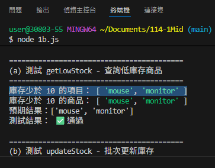
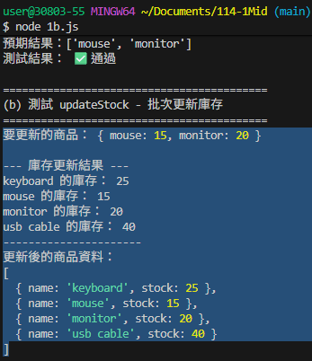
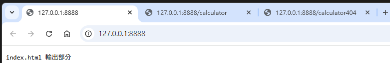
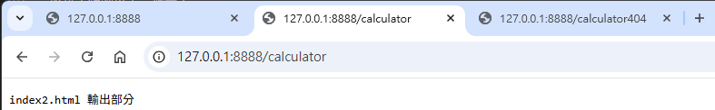
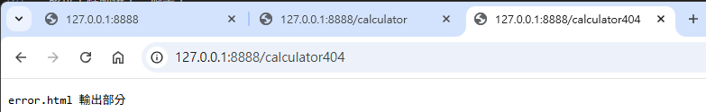
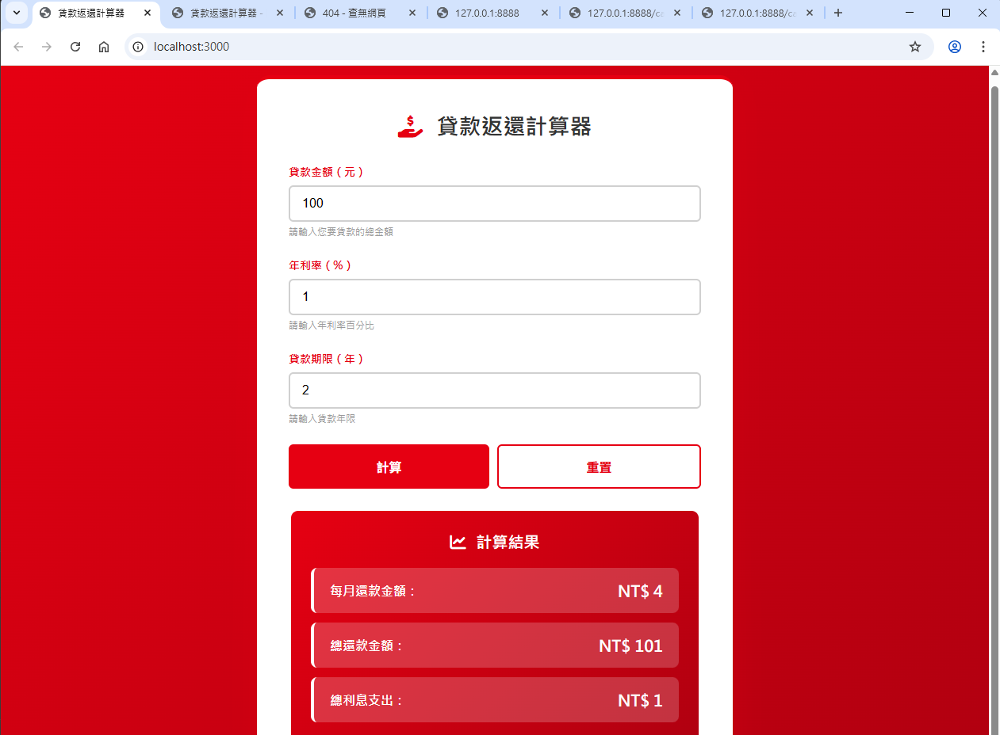
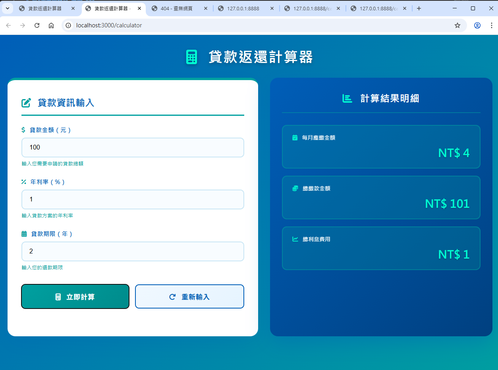

# 第2次隨堂題目-隨堂-QZ2
>
>學號：112111119   (學號和姓名都要寫)
><br />
>姓名：賴俊升
>

本份文件包含以下主題：(至少需下面兩項，若是有多者可以自行新增)
- [x] 說明內容

1. a.

Ans:
<br>
(1) 
1. 陣列宣告
   - 將相同資料型態整合一起,稱為`物件`,於記憶體當中使用`連續空間`
   - 索引值從`0`開始
   - 陣列中個別資料,稱為`元素`
2. const常數宣告
   - const使一個不可變動的關鍵字,例如圓周率=3.14是不可更改的事實,此題用於資料庫存的儲存,亦不能更動
   - 在執行時,程式編譯器會檢查,如果偵測到修改將會報錯
   - 在宣告的同時就必須給值,否則將會發生錯誤

<br>
(2)
 
 ## 從上面敘述可知以下事情
 - 儲存庫存量不可更改的資料,宣告關鍵字應使用`const`,由於陣列是使用連續的空間儲存資料,因此我們在做任何資料調閱行為都可以用`for迴圈+陣列索引值`快速完成。
 

<br>
1. b.

Ans:

<!-- 請撰寫時，最後一句話再寫一次 -->
其輸出結果需以下面格式顯示
```js
function getLowStock(products) {
  var newProducts = []; //宣告一個陣列用來存放庫存量少於10的商品名稱
    
    for (var i = 0; i < products.length; i++) { //使用for迴圈查看所有商品
        if (products[i].stock < 10) { //假如資料函式中的商品數量少於10,則執行下列程式

            newProducts.push(products[i].name); //將商品庫存少於10的商品名稱使用push()方法新增至新的陣列newProducts中
        }
    }
    console.log("庫存少於 10 的項目：",newProducts); // 印出字串"庫存少於 10 的項目："以及newProducts陣列內容
    return newProducts; //回傳newProducts陣列
}
```


1. c.

Ans:

<!--  請撰寫時，第一句話再寫一次  -->
承B,請在同一支js檔案中
```js
function updateStock(products, updates) {
  const updatedProducts = []; //需告一個新的陣列用於存放更新資料

  for (let i = 0; i < products.length; i++) { //使用for迴圈查看所有商品
    const product = products[i]; //將目前商品存放在product變數中
    const productName = product.name; //將目前商品名稱存放在productName變數中
    let newStockValue; //宣告一個變數用於存放更新後的庫存量
    
    // 檢查是否有需要更新的庫存量
    if (updates.hasOwnProperty(productName)) { 
      newStockValue = updates[productName]; //若有則將更新後的庫存量存放在newStockValue變數中
    } else { 
      newStockValue = product.stock; //若無則將原本的庫存量存放在newStockValue變數中
    }
    
    const newProduct = { //建立一個新的物件用於存放更新後的商品資料
      name: productName, //商品名稱不變
      stock: newStockValue //庫存量使用更新後的值
    };
    
    updatedProducts.push(newProduct); //將新的商品物件新增至updatedProducts陣列中
  }

  console.log("--- 庫存更新結果 ---"); //印出字串"--- 庫存更新結果 ---"
  for (let i = 0; i < updatedProducts.length; i++) { //使用for迴圈查看所有更新後的商品
    const product = updatedProducts[i]; //將目前商品存放在product變數中
    console.log(`${product.name} 的庫存： ${product.stock}`); //印出商品名稱以及更新後的庫存量
  }
  console.log("----------------------");
  
  return updatedProducts; //回傳更新後的商品陣列
}
```

2. a.

Ans:

<!--  請撰寫時，第一句話再寫一次  -->
該位工程師先以2a.js作為檔名
```js
// 請寫 switch完成各個收到不同的請求以及輸出不同的回應字串 (使用 switch)
  switch (url) { //根據網址列不同的請求路徑，使用switch判斷設定不同的回應內容
    case '/': //當請求為「/」
      answer = 'index.html 輸出部分'; //設定回應內容為字串'index.html 輸出部分'
      break; //結束本次case

    case '/calculator': //當請求為「/calculator」
      answer = 'index2.html 輸出部分'; //設定回應內容為字串'index2.html 輸出部分'
      break; //結束本次case

    default: //如果請求皆非,則執行default
      answer = 'error.html 輸出部分'; //設定回應內容為字串'error.html 輸出部分'
      break; //結束本次case
    }
```
答案一

<br>
答案二

<br>
答案三

<br>
2. b.

Ans:

<!--  請撰寫時，第一句話再寫一次  -->
由於node js的路由可以如a小題一樣只輸出文字
```js
// Switch根據不同路由要寫的部分
  //需先安裝ejs模組：npm install ejs
  switch (req.url) { //根據網址列不同的請求路徑，使用switch判斷設定不同的回應內容
    case '/': //當請求為「/」
      filePath = '/index.ejs'; //設定回應內容為讀取檔案'/index.ejs'
      break; //結束本次case
    case '/calculator': //當請求為「/calculator」
      filePath = '/index2.ejs'; //設定回應內容為讀取檔案'/index2.ejs'
      break; //結束本次case
    }

  // 判斷是否為靜態資源請求（CSS、JS、PNG）,如果其中之一符合,則執行下列程式
  if (req.url.endsWith('.css') || req.url.endsWith('.js') || req.url.endsWith('.png')) { 
    fileOtherFile = req.url; //設定回應內容為請求的路徑
}
```

答案一

答案二


1. c.

Ans:

<!--  請撰寫時，第一句話和最後一句再寫一次  -->
同b,當請求不為「/」 置換成讀取「index3.ejs」檔案中的畫面
```js
  const error404File = './index3.ejs'; //宣告一個變數將404 錯誤頁面的 EJS 模板路徑指定給他

        fs.readFile(error404File, 'utf8', (err404, content404) => { //讀取404 錯誤頁面的 EJS 模板文件,編碼為utf8(避免中文亂碼),
        //  err404為錯誤物件,content404為讀取到的文件內容
          
          res.writeHead(404, { 'Content-Type': 'text/html; charset=utf-8' }); //設定 HTTP 狀態碼 404（找不到資源）
          if (err404) { //檢查404 錯誤頁面的 EJS 模板文件是否讀取失敗
            console.error('讀取失敗:', err404); //輸出錯誤訊息
            res.end('404 Not Found'); //向客戶端發送404錯誤訊息
          } else { //404 錯誤頁面的 EJS 模板文件讀取成功

            res.end(content404); //將404 錯誤頁面的內容發送給客戶端
          } 
        });
```


2. d.

Ans:

兩次

fs用來讀取檔案,其中包含ejs模板(動態頁面)和靜態資源(css、js、image),當伺服器收到請求,根據url決定讀取哪個檔案

1. 讀取ejs
if (extname === '.ejs')
filePath根據url路徑選擇
如果讀檔失敗,回傳500錯誤否則template檔案內容字串,最後再發送給客戶端


1. else區塊
靜態文件傳送
讀取css、js靜態檔案。fileOtherFile 是請求的 URL
err有值回傳404否則 content 是檔案資料

fs 是伺服器的 "檔案載入器"，沒有它，伺服器無法從資料夾讀頁面或資源，導致網頁空白或樣式失效。程式用非同步讀取，避免伺服器卡住多個請求。